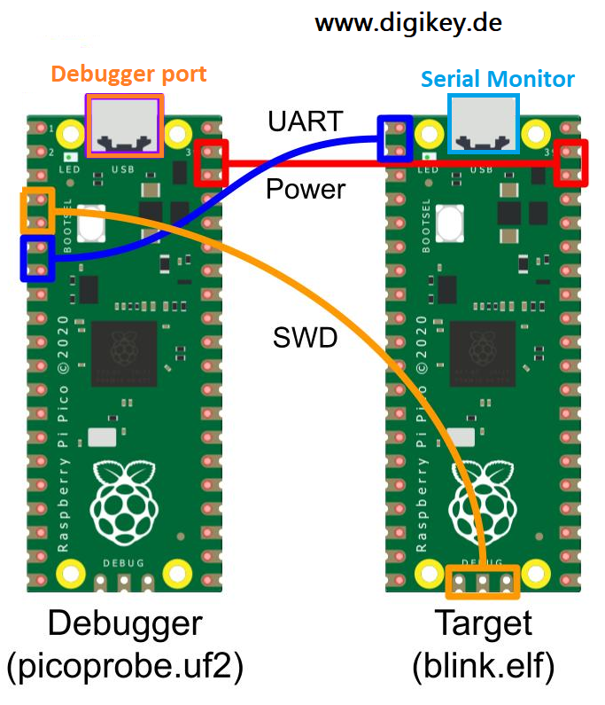
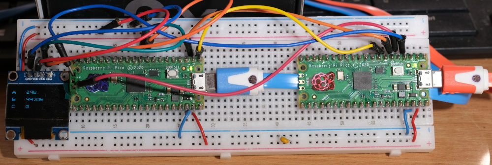
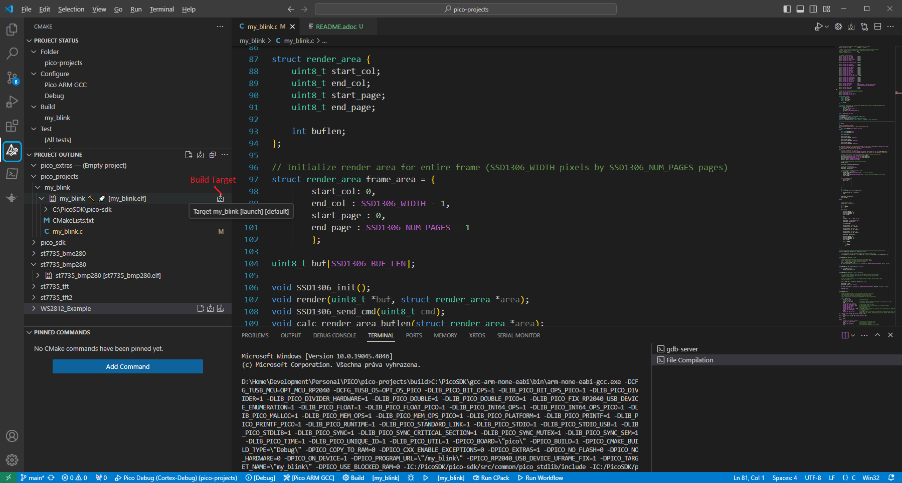
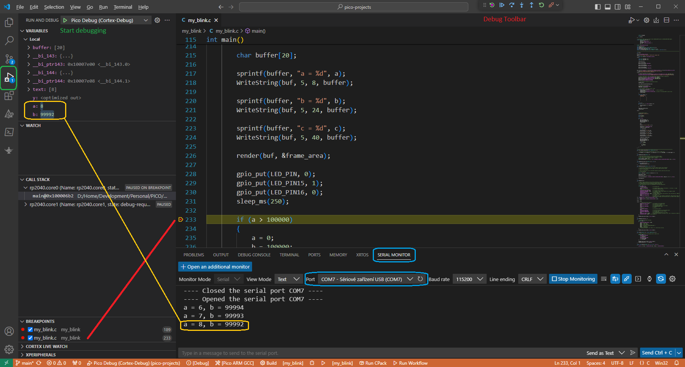

= Mu blink

== Description
[[description]]

The aim of this project is to verify program debugging using PicoProbe. 
There is onboard LED and SSD1306 I2C display.

== Wiring information
[[wiring]]
[pdfwidth=75%]
.Wiring Diagram for Raspberry Pi Pico and SSD1306. Display uses I2C #1, it allows debugging with Picoprobe. So:

== Practical realization
[[board_image]]
[pdfwidth=75%]
.Realization on breadboard.

== Build
[[build_image]]
[pdfwidth=75%]
.Realization on breadboard.

== Debugging
[[debug_image]]
[pdfwidth=75%]
.Realization on breadboard.

