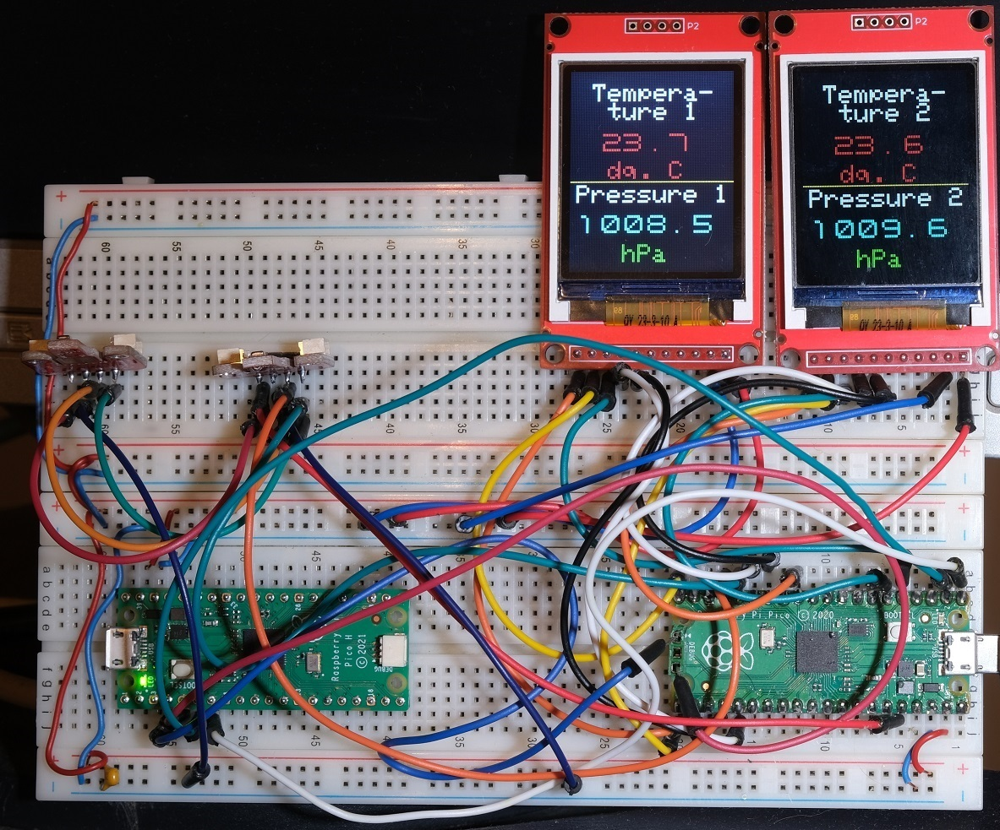

= ST7735 TFT displays, BMP280 sensor and Raspberry PI Pico

== Description
[[description]]

Testing ST7735_TFT with BME280 temperature, pressure and humidity sensor

Original ST7735 repository: https://github.com/gavinlyonsrepo/ST7735_TFT_PICO

== Wiring information
[[ssd1306_i2c_wiring]]
[pdfwidth=75%]
.Wiring Diagram for Raspberry Pi Pico and ST7735 TFT display. Only 1st display is painted. So:

* First display:
* GP17 (SPI0 CSn) -> CS
* GP15 -> RST
* GP3 -> RS
* GP19 (SPI0 TX) -> MOSI
* GP18 (SPI0 SCK) -> CLK
* =========================
* Second display:
* GP9 (SPI1 CSn) -> CS
* GP16 -> RST
* GP4 -> RS
* GP11 (SPI1 TX) -> MOSI
* GP10 (SPI1 SCK) -> CLK
* =========================
* BME280
* SDA -> GP0
* SCL -> GP1

== Practical realization
[[ssd1306_i2c_image]]
[pdfwidth=75%]
.Realization on breadboard.

