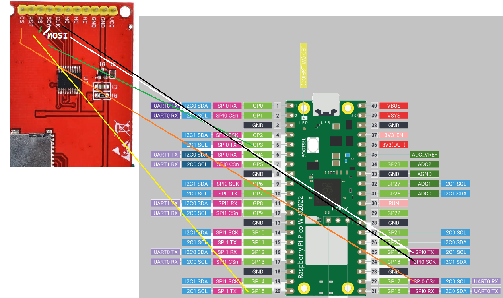
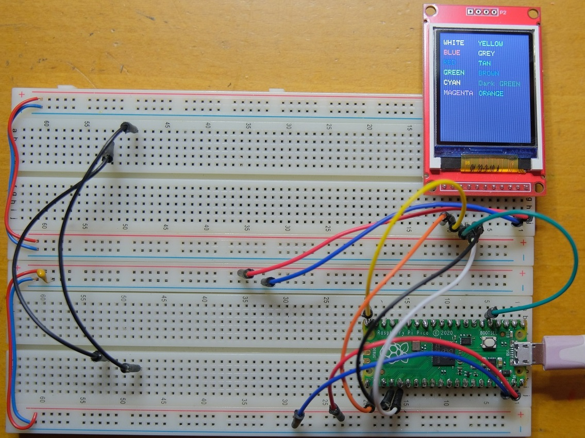

= Testing ST7735_TFT_PICO library by Gavin Lyons

== Description
[[description]]

This is here only for testing 1.8" 128x160 TFT display with controller ST7735, SPI.

Original repository: https://github.com/gavinlyonsrepo/ST7735_TFT_PICO

I have imported it to Visual Studio Code project. I changed PICO pin assignements and 
also screen resolution.

== Wiring information
[[ssd1306_i2c_wiring]]
[pdfwidth=75%]
.Wiring Diagram for Raspberry Pi Pico and ST7735 TFT display

* GP17 (SPI0 CSn) -> CS
* GP15 -> RST
* GP3 -> RS
* GP19 (SPI0 TX) -> MOSI
* GP18 (SPI0 SCK) -> CLK

== Practical realization
[[ssd1306_i2c_image]]
[pdfwidth=75%]
.Realization on breadboard

